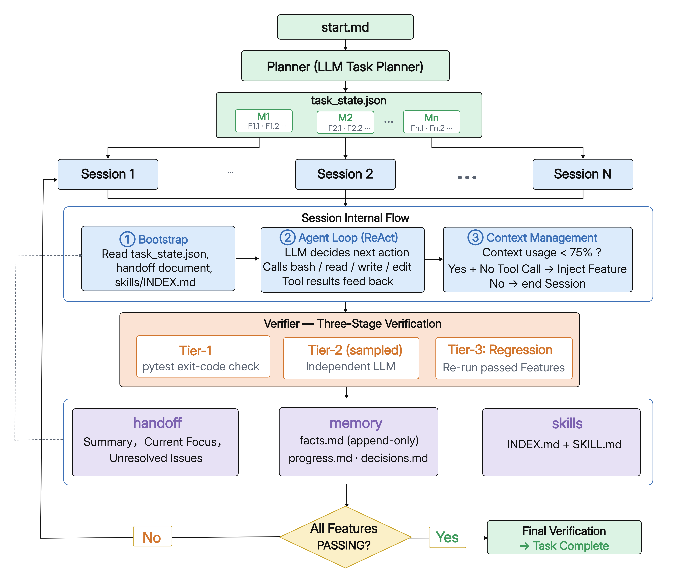

# Long-Running Coding Agent

基于 LLM 的长时间自主编程智能体系统，能够在多会话（multi-session）、多轮验证的环境中自主完成复杂的软件工程任务。使用 NL2RepoBench 基准测试集进行任务驱动开发与评估。
（说明：老师，我在收集链接中提交的实验报告没附上方法设计图，这里提供了更新版实验报告，实验报告（更新版-带方法图）.pdf）
## 智能体架构图



## 目录结构

```
Long-Running_Coding_Agent/
├── run_bench_task.sh              # 启动/恢复任务的入口脚本
├── eval.sh                        # 评估脚本（在智能体完成后运行）
├── my_agent/                      # 智能体核心代码
│   ├── config.yaml                # 全局配置（LLM、会话预算、验证策略等）
│   ├── .env                       # API 密钥（需自行创建）
│   └── harness/                   # 核心引擎
│       ├── cli.py                 # 命令行入口（start / resume / status）
│       ├── orchestrator.py        # 编排器 — 主控制循环，会话生命周期管理
│       ├── agent_loop.py          # 单会话 Agent 循环（ReAct 模式）
│       ├── llm_client.py          # LLM API 客户端（DeepSeek / OpenAI 兼容协议）
│       ├── tools.py               # 工具实现（bash / read / write / edit）
│       ├── verifier.py            # 双阶段验证器（Tier-1 自动化 + Tier-2 LLM 审查）
│       ├── task_state.py          # 任务状态机（Feature / Milestone / 状态转换）
│       ├── context_manager.py     # 上下文管理与会话交接（handoff）
│       ├── config.py              # 配置加载器（多层优先级合并）
│       ├── memory_skill.py        # 记忆与技能持久化管理
│       └── prompts/               # 各角色的 LLM 系统提示词
│           ├── coding_agent.md    # 编码智能体
│           ├── planner.md         # 任务规划器
│           ├── verifier.md        # 代码审查验证器
│           ├── bootstrap.md       # 新会话启动引导
│           ├── on_idle_inject.md  # 空闲时注入新 Feature
│           ├── work_instruction.md
│           └── ...
└── bench-<task_name>/            # 运行时生成的项目目录（每个任务一个）
    ├── config.yaml               # 项目级 Docker 配置
    ├── workspace/                # 代码工作区（智能体在此编写代码）
    ├── .agent/                   # 智能体内部状态
    │   ├── memory/
    │   │   ├── task_state.json   # 核心任务状态（Feature 列表、状态、验证记录）
    │   │   ├── progress.md       # 进度日志（append-only）
    │   │   ├── decisions.md      # 架构决策与约束记录
    │   │   ├── facts.md          # 已验证事实与发现
    │   │   └── handoffs/         # 每会话的结构化交接文档（session_NNNN.md）
    │   └── skills/               # 自动提取的可复用技能库
    │       └── INDEX.md          # 技能索引
    └── logs/                     # 会话转录日志
        ├── session_NNNN.jsonl    # 每会话的完整记录
        ├── verifier_sNNNN_Fx.x.jsonl  # 验证器转录
        ├── snapshots/            # 任务状态快照（用于断点恢复）
        └── run_report.json       # 最终运行报告
```

## 运行说明

### 环境要求

- **Python 3.11**
- **Docker**（用于沙箱执行和评估）
- **Git**

### 1. 拉取 Docker 镜像

```bash
# 运行时沙箱镜像（智能体在其中执行命令）
docker pull ghcr.nju.edu.cn/all-hands-ai/runtime:0.56-nikolaik

# NL2RepoBench 任务测试镜像（以 bleach 为例）
docker pull ghcr.nju.edu.cn/multimodal-art-projection/nl2repobench/bleach:1.0
```

> **注意**：每个 NL2RepoBench 任务都有独立的测试镜像。如果要运行其他任务（如 `pyjwt`、`schema`、`tinydb` 等），需要拉取对应的镜像：
> `docker pull ghcr.nju.edu.cn/multimodal-art-projection/nl2repobench/<task_name>:1.0`

### 2. 克隆 NL2RepoBench

```bash
cd Long-Running_Coding_Agent
git clone https://github.com/multimodal-art-projection/NL2RepoBench.git
```

### 3. 配置 API 密钥

在 `my_agent/.env` 中添加模型 API 密钥和 Base URL：

```bash
# my_agent/.env
DEEPSEEK_API_KEY=sk-your-api-key-here
DEEPSEEK_BASE_URL=https://api.deepseek.com
```

支持的模型配置见 `my_agent/config.yaml`，默认使用 DeepSeek V4 Pro。如需使用其他兼容 OpenAI 协议的 API，修改 `config.yaml` 中的 `llm.model` 和 `llm.base_url` 即可。

### 4. 运行任务

#### 新建任务（从头开始）

```bash
./run_bench_task.sh <task_name>
```

例如：

```bash
./run_bench_task.sh bleach
```

该脚本会：
1. 创建 `bench-<task_name>/` 项目目录结构
2. 生成项目级 `config.yaml`（包含 Docker 容器名）
3. 启动 Docker 运行时容器（挂载工作区）
4. 运行 Planner 将 `start.md` 分解为 Features
5. 启动智能体主循环（Orchestrator）
6. 任务结束或预算耗尽后自动停止容器

#### 恢复中断的任务

```bash
./run_bench_task.sh <task_name> --resume
```

例如：

```bash
./run_bench_task.sh bleach --resume
```

恢复逻辑：
1. 找到最新的任务状态快照（`logs/snapshots/task_state_sNNNN.json`）
2. 恢复到 `task_state.json`
3. 删除不完整的会话日志（快照之后的 session）
4. 从下一个会话编号继续

#### 关闭验证运行

使用 `run_bench_task_no_verify.sh` 可以在**跳过所有验证环节**的情况下运行智能体——模型自报的完成状态被直接信任，不再执行 Tier-1 自动化测试和 Tier-2 独立 LLM 审查。项目目录和 Docker 容器名会自动添加 `-no-verify` 后缀，与正常验证运行的产物隔离。

```bash
# 关闭验证运行
./run_bench_task_no_verify.sh bleach
./run_bench_task_no_verify.sh decouple

# 恢复中断的任务
./run_bench_task_no_verify.sh bleach --resume

# 评估（目录名需对应）
./eval.sh bench-bleach-no-verify bleach
```

运行后生成的 `bench-<task>-no-verify/` 目录结构与正常模式一致，区别在于其 `config.yaml` 中显式设置了 `verification.enabled: false`，覆盖默认配置。

### 5. 评估结果

智能体运行完成后，执行评估脚本：

```bash
./eval.sh bench-<task_name> <task_name>
```

例如：

```bash
./eval.sh bench-bleach bleach
```

评估流程：
1. 读取 `test_files.json`，从智能体的工作区中排除预设的测试文件
2. 在测试 Docker 镜像基础上叠加智能体的代码
3. 在容器中运行 `test_commands.json` 中定义的测试命令
4. 解析 pytest 输出，计算得分
5. 保存评估结果到 `eval-result.json` 和 `eval.log`

评估结果示例：

```
============================================
  Result: passed
  Score:  85.7%
  Tests:  42 passed, 5 failed, 2 errors
  Expected: 49 total
  Exit:   0
============================================

Saved:
  Log:    bench-bleach/eval.log
  Result: bench-bleach/eval-result.json
```


## 智能体基本架构

### 三层架构

```
┌─────────────────────────────────────────────────────────┐
│                   Orchestrator（编排层）                  │
│  ┌──────────┐  ┌────────────┐  ┌────────────────────┐  │
│  │ Planner  │  │ 会话调度器  │  │ 验证调度 + 回归检测 │  │
│  │ 任务分解  │  │ Feature选择 │  │ Tier-1 + Tier-2     │  │
│  └──────────┘  └────────────┘  └────────────────────┘  │
│  ┌──────────────┐  ┌────────────┐  ┌────────────────┐  │
│  │ 动态重规划    │  │ 自动交接    │  │ 技能提取       │  │
│  │ (replan)     │  │ (handoff)   │  │ (skill extract)│  │
│  └──────────────┘  └────────────┘  └────────────────┘  │
├─────────────────────────────────────────────────────────┤
│                   Agent Loop（执行层）                    │
│  ┌──────────────────────────────────────────────────┐   │
│  │  ReAct 循环: LLM思考 → 工具调用 → 结果反馈 → ...  │   │
│  │  工具: bash / read / write / edit                 │   │
│  │  上下文管理: 过期工具结果清理 + 多Feature连续工作   │   │
│  └──────────────────────────────────────────────────┘   │
├─────────────────────────────────────────────────────────┤
│                   Verifier（验证层）                      │
│  ┌──────────────────┐  ┌────────────────────────────┐   │
│  │ Tier-1: 自动测试  │  │ Tier-2: 独立LLM代码审查    │   │
│  │ pytest/exit_code  │  │ 无编码历史偏见 + 回归检测   │   │
│  └──────────────────┘  └────────────────────────────┘   │
└─────────────────────────────────────────────────────────┘
```

### 核心设计原则

1. **验证驱动**：智能体不能自行标记 Feature 为"完成"——只有通过 Tier-1（自动测试）和 Tier-2（独立 LLM 审查）双重验证后，状态才能变为 PASSING。这防止了模型的"幻觉完成"问题。

2. **上下文驱动的会话切换**：不是在每个 Feature 后都切换会话，而是当上下文窗口使用率达到 ~75% 时才结束会话。一个会话可以连续处理多个 Feature，模型空闲时通过 `on_idle` 回调注入下一个 Feature。

3. **跨会话记忆系统**：
   - `task_state.json` — 结构化核心状态（唯一真相源）
   - `progress.md` — 每会话的进度摘要（append-only）
   - `decisions.md` — 架构决策与约束（append-only）
   - `facts.md` — 智能体发现的非显而易见的事实（append-only）
   - `handoffs/*.md` — 每会话的结构化交接文档

4. **技能积累**：当一个 Feature 经过多次重试才成功时，编排器会自动从会话转录中提取修复模式，创建可复用的 Skill 文件。后续会话可以通过 `INDEX.md` 发现和加载这些技能。

5. **Docker 沙箱执行**：所有 bash 命令在隔离的 Docker 容器中运行，工作区通过 volume 挂载。智能体的文件操作（read/write/edit）自动进行路径映射（host ↔ container）。

6. **断点恢复**：每次验证成功后保存 `task_state.json` 快照。中断后恢复时，自动找到最新快照，清理不完整的会话日志，从断点继续。

### 任务执行流程

```
spec (start.md)
    │
    ▼
┌──────────┐
│ Planner  │  将 spec 分解为 Milestones 和 Features
└────┬─────┘
     │
     ▼
┌──────────────────────────────────────────────┐
│              主循环 (Orchestrator)             │
│                                              │
│  Session 1 ──────────────────────────┐       │
│  │ Feature F1.1 → F1.2 → (上下文满)  │       │
│  │ → 验证 → 交接 → 快照              │       │
│  └───────────────────────────────────┘       │
│                                              │
│  Session 2 ──────────────────────────┐       │
│  │ 读取交接 → Feature F2.1 → F2.2    │       │
│  │ → 验证 → 回归检测 → 交接 → 快照   │       │
│  └───────────────────────────────────┘       │
│                                              │
│  ... 重复直到全部 Feature 验证通过 ...        │
│                                              │
│  Final Verification → 任务完成                │
└──────────────────────────────────────────────┘
```

### 验证流程

```
Feature 标记为 "passing"（智能体声称完成）
    │
    ▼
┌─────────────────────────────┐
│ Tier-1: 执行 acceptance 命令  │  例如: pytest tests/ -q -k "feature_name"
│ 检查 exit_code               │
└──────────┬──────────────────┘
           │
    pass?  │  fail → 标记 FAILED，增加重试计数
           │
    ▼
┌─────────────────────────────┐
│ Tier-2: 独立 LLM 审查        │  独立的 LLM 会话，无编码历史偏见
│ 采样率 30%（可配置）          │  读取代码文件 → 给出 VERDICT: pass|fail
│ 失败过的 Feature 100% 审查    │
└──────────┬──────────────────┘
           │
    pass?  │  fail → 标记 FAILED
           │
    ▼
┌─────────────────────────────┐
│ 回归检测                      │  重跑所有之前通过的 Feature 的 acceptance
│                              │  如果新代码破坏了旧功能 → 标记 FAILED
└──────────┬──────────────────┘
           │
    全部通过 → 标记 PASSING ✓
```

## 可用任务列表

NL2RepoBench 包含 100+ 个 Python 开源项目任务，部分示例如下：

| 任务名 | 描述 |
|--------|------|
| `bleach` | HTML 清理库 |
| `decouple` | 配置管理库 |
| `pyjwt` | JWT 编码/解码 |
| `schema` | 数据验证库 |
| `tinydb` | 轻量级文档数据库 |
| `sqlparse` | SQL 解析器 |
| `markupsafe` | HTML 安全转义 |
| `icecream` | 调试输出工具 |
| `jsonlines` | JSONL 文件处理 |
| `freezegun` | 时间模拟库 |

完整列表见 `NL2RepoBench-main/test_files/` 目录。

## 配置说明

### 智能体配置 (`my_agent/config.yaml`)

```yaml
# LLM 配置
llm:
  model: "deepseek-v4-pro"         # 主编码智能体模型
  base_url: "https://api.deepseek.com"
  thinking_mode: "thinking"        # non-thinking | thinking | thinking_max

# 会话预算
session:
  max_turns: 200                   # 每会话最大工具调用轮数
  max_tokens: 750000               # 每会话最大 token 消耗
  context_window: 1000000          # 模型上下文窗口大小
  switch_ratio: 0.75               # 上下文使用率达到 75% 时切换会话

# 任务预算
budget:
  max_sessions: 40                 # 最大会话数
  max_wall_clock_hours: 8          # 最大运行时间（小时）

# 验证配置
verification:
  tier2_enabled: true              # 是否启用 Tier-2 LLM 审查
  tier2_sample_rate: 0.3           # Tier-2 采样率（失败过的 Feature 100% 审查）
  max_retry_attempts: 5            # Feature 最大重试次数
```

### 项目配置 (`bench-<task>/config.yaml`)

```yaml
docker:
  runtime_container: "bench-runtime-<task>"   # Docker 容器名
  test_image_prefix: "ghcr.nju.edu.cn/multimodal-art-projection/nl2repobench"
```

## 日志与调试

- **会话转录**：`bench-<task>/logs/session_NNNN.jsonl` — 包含每轮 LLM 响应和工具执行结果
- **验证转录**：`bench-<task>/logs/verifier_sNNNN_Fx.x.jsonl` — Verifier 的独立审查过程
- **运行报告**：`bench-<task>/logs/run_report.json` — 包含所有会话统计、Feature 状态、验证结果的汇总
- **交接文档**：`bench-<task>/.agent/memory/handoffs/session_NNNN.md` — 每会话的结构化交接信息
- **评估结果**：`bench-<task>/eval-result.json` 和 `bench-<task>/eval.log`
